# CS898BA Project 1

## Student Information

**Name:** Chiranjeevi Venkata Shiva Ruthvik Savaram

## Project Overview

This repository contains Homework 1, Homework 2, and Homework 3 for CS898BA – Image Analysis and Computer Vision. Throughout these assignments, I implemented several classical image processing, image segmentation, and deep learning techniques using Python, OpenCV, and PyTorch.

Homework 1 focused on image analysis, preprocessing, affine transformations, Gaussian blurring, image subsets, and edge detection.

Homework 2 extended the same assignment by implementing image segmentation techniques including multi-channel color normalization, threshold-based segmentation, K-Means clustering, and quantitative evaluation using IoU and Dice Coefficient.

Homework 3 further extended the project by implementing deep learning–based image classification using a custom Convolutional Neural Network (CNN). The assignment included dataset preparation, CNN training, hyperparameter tuning, and model evaluation using Accuracy, Precision, Recall, F1-score, and a confusion matrix.

## Software and Libraries Used

* Python
* OpenCV
* NumPy
* SciPy
* Matplotlib
* PyTorch
* Torchvision
* Scikit-learn

## How to Run the Program

1. Clone or download the project repository.
2. Open the project folder in VS Code.
3. Install the required libraries listed in `requirements.txt`.

```bash
pip install -r requirements.txt
```

4. Place the homework image(alien.jpg) inside the `images` folder.
5. Run the commands in the following order in the terminal:

```bash
python src/image_statistics.py
python src/conversions.py
python src/affine_transformations.py
python src/gaussian_blur.py
python src/image_subsets.py
python src/edge_detection.py
python src/plots.py
```
6. Run the Homework 2 scripts:

```bash
python src/color_normalization.py
python src/threshold_segmentation.py
python src/kmeans_segmentation.py
python src/evaluate_segmentation.py
```
7. Download the Homework 3 fish image dataset and place it inside the project directory as described in the project structure.

8. Run the Homework 3 scripts in the following order:

```bash
python src/prepare_fish_dataset.py
python src/baseline_cnn.py
python src/hyperparameter_tuning.py
python src/evaluate_tuned_cnn.py
```

# Homework 1

## Tasks Completed

* Calculated image statistics for each RGB channel
* Converted the image to grayscale
* Created a binary image
* Converted the image to HSV, LAB, and HLS color spaces
* Applied histogram equalization to the V channel of the HSV image
* Converted the normalized image back to RGB
* Performed affine transformations using rotations and translations
* Applied Gaussian blur using multiple sigma values
* Created four random subsets containing 42 images each
* Applied Sobel edge detection
* Applied Laplacian edge detection
* Applied Canny edge detection
* Applied Prewitt edge detection
* Generated comparison plots for edge detection results

## Results

Homework 1 successfully generated all the required output images for the assignment. The preprocessing, image transformation, and edge detection techniques produced different results, making it possible to compare their performance on the same image dataset. The generated outputs and comparison plots helped evaluate how each method affected image quality and feature extraction.

## Gaussian Blur Analysis

Gaussian blur was applied using sigma values of 0.5, 1.0, 1.5, 2.0, 2.5, 3.0, and 3.5.

As the sigma value increased, the images became smoother and less detailed. Lower sigma values preserved most image features while reducing minor noise. Higher sigma values produced stronger blurring effects and removed more image details. While larger sigma values helped reduce noise, they also made object boundaries less visible.

## Edge Detection Analysis

Four edge detection techniques were applied to the selected subset of images.

### Sobel

Sobel detected major edges and object boundaries clearly while maintaining a good balance between detail and noise reduction.

**Advantages**
* Produces strong edge responses
* Less sensitive to noise
* Easy to interpret

**Disadvantages**
* May miss very fine details
* Produces thicker edges than some methods

### Laplacian

Laplacian detected fine intensity changes and highlighted many image details.

**Advantages**
* Detects edges in all directions
* Captures fine image details

**Disadvantages**
* Sensitive to image noise
* Produces extra edge responses in some images

### Canny

Canny generated thin and precise edges through a multi-stage detection process.

**Advantages**
* Produces clean and well-defined edges
* Reduces false edge detections

**Disadvantages**
* Depends on threshold selection
* Some weaker edges may not be detected

### Prewitt

Prewitt produced results similar to Sobel but generally showed weaker edge responses.

**Advantages**
* Simple implementation
* Detects major edges reasonably well

**Disadvantages**
* More sensitive to noise than Sobel
* Edge responses are generally weaker

## Best Performing Method

Based on visual comparison of the generated outputs, Sobel provided the most useful and consistent edge detection results for this dataset. It highlighted the major object boundaries while reducing unnecessary noise. Although Canny produced cleaner edges in some cases, Sobel provided a better balance between edge visibility and detail preservation across the image set. Even though prewitt provided a similar amount of good images as Sobel, Sobel produced clearer and more visible edge images.

## Sample Comparison Plots

The following six plots were randomly selected from the forty-two generated comparison plots.

### Plot 1

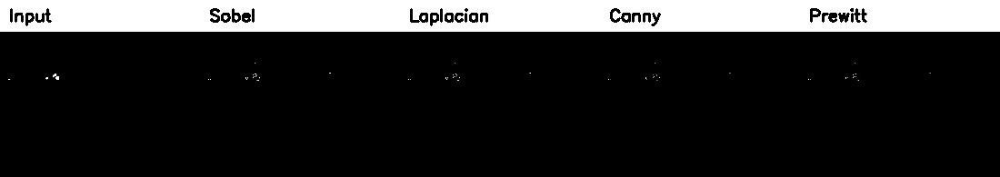

### Plot 2

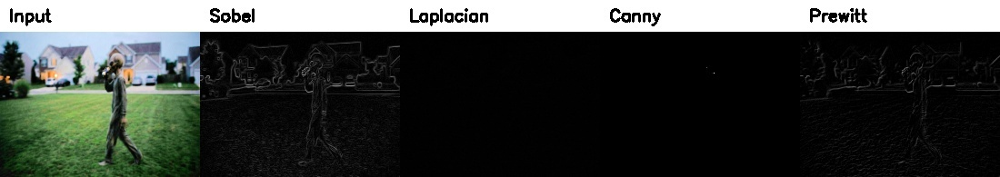

### Plot 3

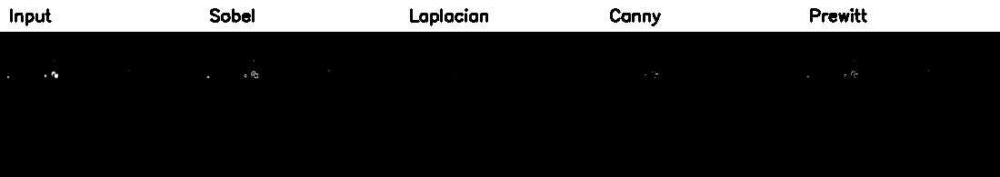

### Plot 4

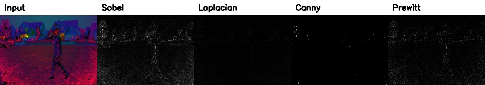

### Plot 5

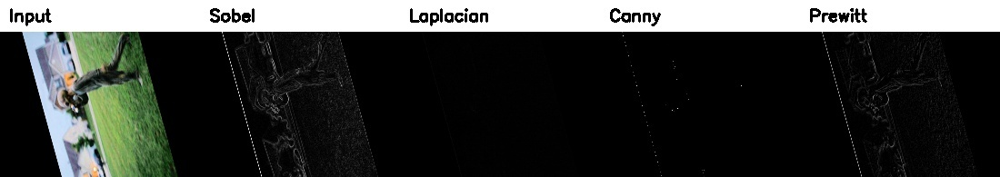

### Plot 6

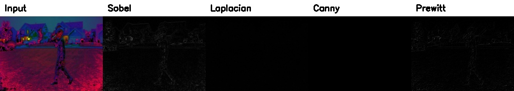

# Homework 2

## Tasks Completed

The following image segmentation tasks were completed as part of Homework 2:

* Applied multi-channel histogram equalization for color normalization
* Converted the normalized image to grayscale
* Applied Otsu's global thresholding
* Applied Adaptive Gaussian thresholding
* Converted the normalized image to HSV color space
* Applied K-Means clustering using K values of 3, 4, and 5
* Selected K = 3 as the final segmentation result
* Created a manual reference mask to serve as the pseudo-ground truth
* Calculated the Intersection over Union (IoU) for each segmentation method
* Calculated the Dice Coefficient for each segmentation method
* Generated a final comparison plot showing all segmentation results

## Results

Homework 2 successfully generated all the required segmentation outputs, including threshold-based masks, K-Means segmentation results, a manually created reference mask, and a final comparison plot. Both qualitative observations and quantitative evaluation using IoU and Dice Coefficient were used to compare the performance of the segmentation methods.

## Multi-Channel Color Normalization

Before performing image segmentation, histogram equalization was applied independently to each color channel of the original image. After equalization, the channels were merged to create a normalized color image.

This preprocessing step improved the overall image contrast and made the foreground object easier to distinguish from the background. The normalized image was then used as the input for all subsequent segmentation techniques.

## Threshold-Based Segmentation

Two threshold-based segmentation methods were implemented using the normalized grayscale image.

### Otsu's Global Thresholding

Otsu's thresholding automatically selected a single threshold value to separate the foreground from the background.

**Advantages**

* Automatic threshold selection
* Simple and computationally efficient
* Easy to implement

**Disadvantages**

* Assumes uniform illumination
* Sensitive to shadows and uneven lighting
* Included background objects in several regions

### Adaptive Gaussian Thresholding

Adaptive thresholding calculated a local threshold for different regions of the image using a Gaussian window.

**Advantages**

* Handles local illumination changes
* Detected more foreground details
* Better suited for varying lighting conditions

**Disadvantages**

* Produced additional background noise
* Generated several unwanted foreground regions
* Required parameter tuning

## K-Means Segmentation

The normalized image was converted to the HSV color space before applying K-Means clustering.

Three different values of K were tested:

* K = 3
* K = 4
* K = 5

After visually comparing the segmentation results, **K = 3** was selected because it produced the clearest separation of the central figure while minimizing unnecessary segmentation of the surrounding background.

**Advantages**

* Uses color information rather than only pixel intensity
* Produced the cleanest segmentation among the three methods
* Better preserved the overall shape of the figure

**Disadvantages**

* Required selecting an appropriate K value
* Some background regions were still grouped with the foreground
* Results depended on the image content

## Effect of Color Normalization

Compared to the original image used in Homework 1, the normalized color image produced higher contrast between the foreground and background.

Applying histogram equalization independently to each color channel improved the visibility of the figure before segmentation. This helped all three segmentation methods produce more distinguishable foreground regions, although background noise was still present because of the challenging outdoor lighting conditions.

## Qualitative Analysis

Each segmentation technique produced different results when applied to the normalized image.

Otsu's thresholding was simple and fast but struggled with uneven illumination and included several unwanted background regions. Adaptive thresholding handled local brightness changes more effectively, but it introduced additional noise by detecting small background details such as leaves and porch structures.

Among the three methods, K-Means segmentation produced the most consistent result. Using color information allowed it to separate the central figure from much of the surrounding background while preserving the overall shape of the figure better than the threshold-based methods.

Overall, K-Means with **K = 3** provided the best visual segmentation for this dataset.

## Quantitative Evaluation

A manual reference mask was created to serve as the pseudo-ground truth for evaluating the segmentation methods.

The following performance metrics were calculated.

| Segmentation Method | IoU | Dice Coefficient |
|---------------------|----:|-----------------:|
| Otsu Thresholding | 0.0575 | 0.1088 |
| Adaptive Thresholding | 0.0851 | 0.1569 |
| K-Means (K = 3) | **0.1510** | **0.2624** |

Although the overall scores are relatively low because of the difficult lighting conditions and complex background, K-Means achieved the highest IoU and Dice values among the three methods, indicating the closest match to the manually created reference mask.

## Final Segmentation Comparison

The following figure compares the original image, normalized image, manually created reference mask, and the three final segmentation masks.

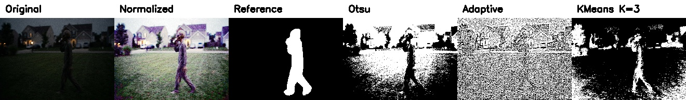

# Homework 3

## Tasks Completed

The following deep learning image classification tasks were completed as part of Homework 3:

* Verified the fish image dataset and removed invalid images
* Split the dataset into training, validation, and testing sets
* Resized all images to a consistent input size
* Implemented a custom Convolutional Neural Network (CNN) using PyTorch
* Trained a baseline CNN model
* Saved the best model checkpoint based on validation performance
* Generated training and validation accuracy and loss plots
* Performed hyperparameter tuning using different learning rates, batch sizes, and dropout values
* Selected the best-performing hyperparameter configuration
* Evaluated the tuned CNN on the unseen test dataset
* Generated a confusion matrix and classification report
* Calculated Accuracy, Precision, Recall, and F1-score

## Results

Homework 3 successfully trained and evaluated a custom CNN for fish image classification. The project included dataset preparation, baseline model training, hyperparameter tuning, and final evaluation on an unseen test dataset. Performance was assessed using Accuracy, Precision, Recall, F1-score, and a confusion matrix.

The project also generated training and validation accuracy/loss plots, hyperparameter tuning comparison plots, saved model checkpoints, evaluation metrics in JSON format, and confusion matrices. These outputs were used to compare different CNN configurations and document the final model's performance.

## Dataset Preparation

Before training the CNN, the fish image dataset was verified to ensure that all images were valid and could be processed correctly. The images were resized to a consistent resolution and divided into training, validation, and testing subsets using a reproducible random seed.

This preprocessing step ensured that all experiments were performed on a consistent dataset and that the trained models could be evaluated fairly on unseen data.

## Baseline CNN

A custom Convolutional Neural Network (CNN) was implemented using PyTorch for image classification.

The network consisted of convolutional layers, ReLU activation functions, max pooling layers, dropout regularization, and fully connected layers for classification.

The baseline model was trained using the prepared dataset, and the best-performing model was automatically saved according to validation performance. Training and validation accuracy and loss plots were generated to monitor the learning process.

## Training Curves

The following figures show the training accuracy and training loss of the baseline CNN during model training.

### Training Accuracy

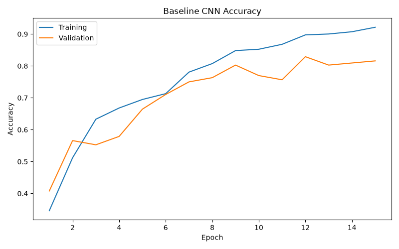

### Training Loss

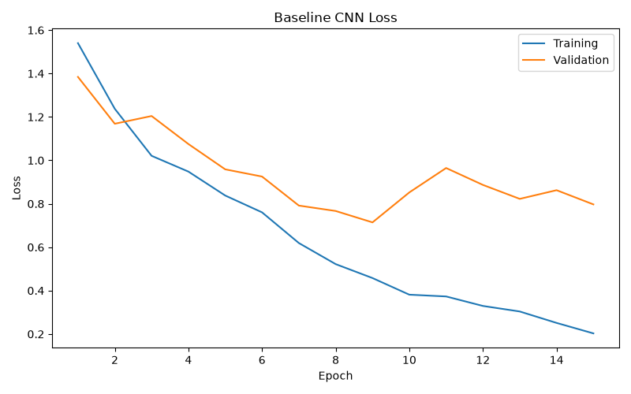

## Hyperparameter Tuning

Four different CNN configurations were evaluated by modifying one hyperparameter at a time.

The following parameters were compared:

* Baseline configuration
* Lower learning rate
* Smaller batch size
* Higher dropout rate

Among the four experiments, the configuration using a **batch size of 16** produced the highest validation accuracy and was selected for the final evaluation.

## Hyperparameter Comparison

The following figure compares the validation performance of the different hyperparameter configurations evaluated during Homework 3.

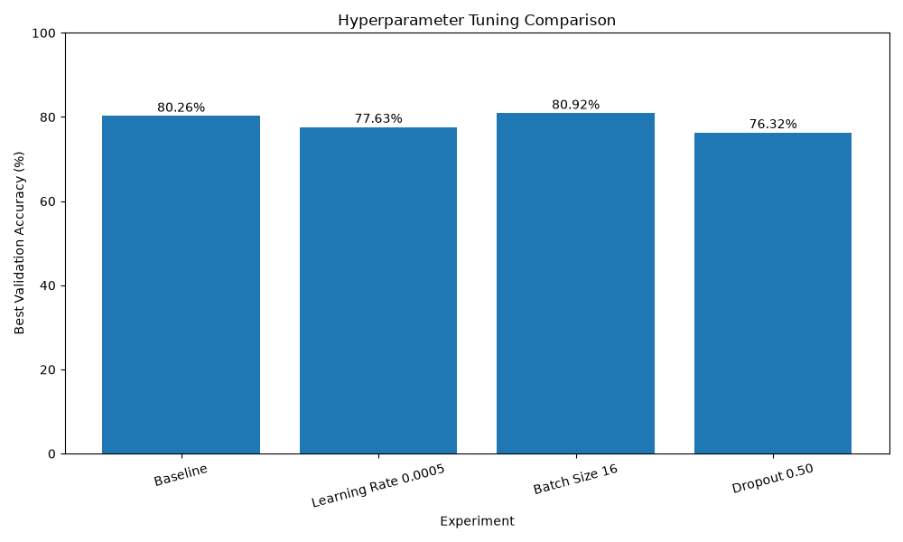

## Final Evaluation

The selected CNN model was evaluated on the unseen test dataset.

The following performance metrics were calculated.

| Metric | Value |
|---------|-------:|
| Accuracy | **77.12%** |
| Precision | **73.92%** |
| Recall | **74.39%** |
| F1-score | **73.52%** |

A confusion matrix and a detailed classification report were also generated to evaluate the prediction performance for each fish species.

## Confusion Matrix

The following confusion matrix summarizes the prediction performance of the final tuned CNN on the test dataset.

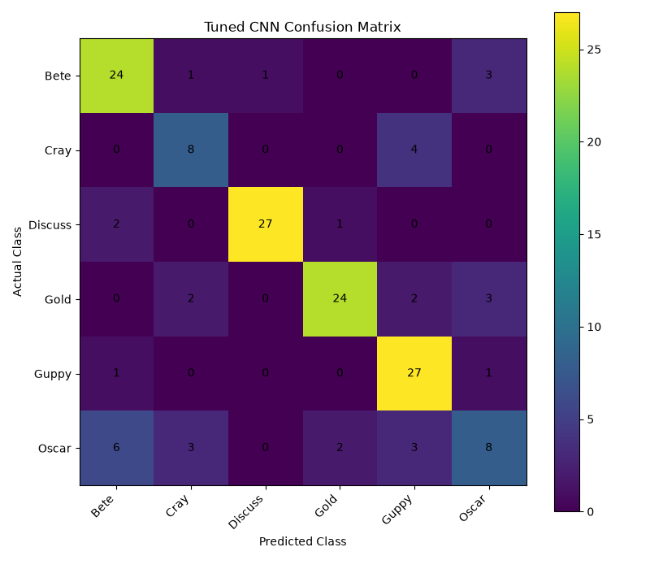

## Model Performance Analysis

The CNN successfully learned meaningful visual features from the fish image dataset and achieved good overall classification performance.

Hyperparameter tuning showed that reducing the batch size from 32 to 16 slightly improved validation performance, while decreasing the learning rate or increasing the dropout rate did not improve the final model.

Although some visually similar fish species were occasionally misclassified, the CNN demonstrated that deep learning methods can effectively perform multi-class image classification without manually designing image features.

## Overall Conclusion

This repository demonstrates the implementation of several classical image processing, computer vision, and deep learning techniques using Python, OpenCV, and PyTorch.

In Homework 1, the focus was on image preprocessing, image enhancement, affine transformations, Gaussian blurring, and edge detection. Different edge detection methods were compared to understand how each technique responds to the same image dataset. Based on the visual results, Sobel provided the most consistent edge detection performance by preserving important object boundaries while reducing unnecessary noise.

Homework 2 extended the project by applying image segmentation techniques. Multi-channel color normalization improved the image contrast before segmentation, while Otsu's Thresholding, Adaptive Thresholding, and K-Means clustering were implemented and evaluated. Both qualitative observations and quantitative metrics (IoU and Dice Coefficient) were used to compare the segmentation methods. Among the three techniques, K-Means with **K = 3** produced the best overall segmentation result for this dataset.

Homework 3 further extended the project by introducing deep learning–based image classification. A custom Convolutional Neural Network (CNN) was developed using PyTorch, trained on a prepared fish image dataset, and improved through hyperparameter tuning. The final model was evaluated using Accuracy, Precision, Recall, F1-score, a confusion matrix, and a classification report to measure its performance on unseen test data.

Overall, these assignments provided practical experience with image preprocessing, feature extraction, edge detection, image segmentation, deep learning, and quantitative performance evaluation. Together, they demonstrate how classical computer vision techniques and modern deep learning methods can be combined to solve real-world image analysis and image classification problems.

